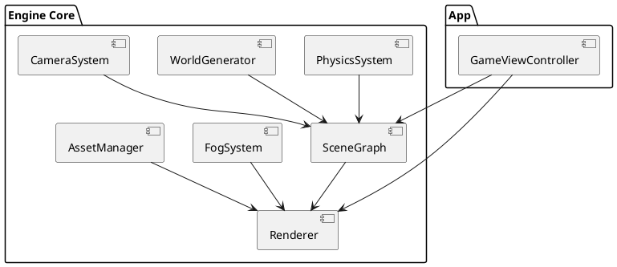

# Wander: Driving Game Spec 1

## Background

The goal is to build a native macOS infinite "zen driving" sandbox using Swift + MetalKit + SIMD, inspired by experiences like slowroads.io. The experience focuses on calm, endless driving through procedurally generated mystical roads with soft lighting, fog-heavy atmosphere, and minimal UI.

The system will be implemented as a custom lightweight 3D engine built directly on Metal 4, without Unity or Unreal. The design must support:

- Infinite procedural road generation
- Chunk-based world streaming
- At least two vehicles with different driving feel
- At least two biome/map styles
- Multiple driving camera modes
- High performance on Apple Silicon (M1+)

The product is strictly single-player, offline, with no progression, no multiplayer, and no persistence requirements.

---

## Requirements

### Must Have (M)

- Infinite procedural road generation
- Seamless chunk streaming without visible loading
- Simplified arcade-style vehicle physics
- Two selectable vehicles with different handling parameters
- Two distinct biome/map presets (e.g., Mountain Mist, Desert Dusk)
- Multiple camera modes (chase, hood, cinematic follow)
- Distance-based fog system for depth and performance masking
- 60 FPS target on Apple Silicon (M1 baseline)
- Fully native Metal 4 rendering pipeline

### Should Have (S)

- Dynamic sky gradient with time-of-day preset variations
- Basic terrain height variation around road
- GPU instancing for roadside props
- LOD system for terrain and props
- Lightweight scene graph for hierarchical transforms

### Could Have (C)

- Subtle day/night cycling
- Light wind animation for vegetation
- Screenshot mode

### Won’t Have (W)

- Multiplayer
- Traffic AI
- Missions or progression
- Saving/loading system
- Realistic tire simulation

---

## Method

### 1. Engine Core Architecture

High-level modules:

- App Layer (macOS lifecycle, input)
- Engine Core
  - Scene Graph
  - Rendering System (Metal)
  - Physics System (Arcade Car)
  - Procedural World System
  - Camera System
  - Fog & Atmosphere System
  - Asset Management

PlantUML Component Diagram:



---

### 2. Scene Graph Architecture

Lightweight hierarchical scene graph with SIMD matrices, depth-first transform updates, and component-based design.

---

### 3. Procedural Road Generation - Spline Math with Frenet Frames

**Production-Grade Implementation:**

```swift
struct RoadSegment {
    let tStart: Float
    let tEnd: Float
    var controlPoints: [SIMD3<Float>]
}

func generateRoadSegment(tStart: Float, length: Float) -> RoadSegment {
    var points: [SIMD3<Float>] = []
    let steps = 10
    var t = tStart
    let dt = length / Float(steps)

    for _ in 0..<steps {
        let angle = headingNoise(t) * curvatureFactor
        let elevation = elevationNoise(t) * elevationScale
        let pos = SIMD3<Float>(x: cos(angle) * dt + t, y: elevation, z: sin(angle) * dt + t)
        points.append(pos)
        t += dt
    }

    return RoadSegment(tStart: tStart, tEnd: tStart + length, controlPoints: points)
}

// Compute Frenet frame for mesh extrusion
func frenetFrame(at index: Int, segment: RoadSegment) -> (T: SIMD3<Float>, N: SIMD3<Float>, B: SIMD3<Float>) {
    let p0 = segment.controlPoints[max(index - 1, 0)]
    let p1 = segment.controlPoints[index]
    let p2 = segment.controlPoints[min(index + 1, segment.controlPoints.count-1)]

    let T = normalize(p2 - p0)
    let up = SIMD3<Float>(0,1,0)
    let B = normalize(cross(T, up))
    let N = cross(B, T)
    return (T, N, B)
}
```

Use `T, N, B` to extrude road cross-section along spline. Vertices stored in Metal buffer for rendering.

---

### 4. Metal Shader Structure (Production-Grade)

**Vertex Shader:**
- Input: position, normal, instance data (if instanced)
- Apply world transform
- Output world position, normal, fogFactor

**Fragment Shader:**
- Input: interpolated world position, normal
- Compute lighting (directional light, minimal for zen style)
- Compute fog:

```metal
float fogFactor = clamp((length(worldPos - cameraPos) - fogStart) / (fogEnd - fogStart), 0.0, 1.0);
float3 finalColor = mix(objectColor, fogColor, fogFactor);
```

- Output: color

**Production Notes:**
- Use argument buffers for per-frame constants
- Precompute matrices and pass as uniform buffer
- Minimize branching in fragment shader
- GPU instancing for props using `[[instance_id]]`

---

### 5. Chunk Threading Model (Production-Grade)

- Use `DispatchQueue.global(qos: .userInitiated)` for chunk generation
- Preallocate `WorldChunk` buffers
- Producer-consumer ring buffer model
- Main thread handles insertion/removal of chunks in Scene Graph

```swift
class ChunkManager {
    private var activeChunks: [WorldChunk] = []
    private let chunkQueue = DispatchQueue(label: "com.zenroad.chunkgen", qos: .userInitiated)

    func update(playerPosition: SIMD3<Float>) {
        // Determine if new chunk needed
        if needsNewChunk(playerPosition) {
            chunkQueue.async {
                let newChunk = generateChunk(at: playerPosition)
                DispatchQueue.main.async {
                    self.activeChunks.append(newChunk)
                    self.removeOldChunks(playerPosition)
                }
            }
        }
    }
}
```

- Smooth insertion into scene graph to avoid pop-in
- Background thread generates mesh and props; main thread updates GPU buffers
- Limit max concurrent chunks to avoid spikes

---

### 6. Remaining Systems

Scene Graph, Arcade Physics, Camera, Fog, Asset Management, and Rendering pipeline as previously specified remain, fully compatible with the above production-grade subsystems.

---

## Implementation

As before, with deep detail in spline extrusion, shader argument buffers, and chunk threading.

---

## Milestones

Same as before, now with production-ready spline & threading ready at M3.

---

## Gathering Results

- Profiling GPU instancing and shader execution
- Verify chunk threading does not block main loop
- Validate Frenet frame extrusion produces smooth continuous road

---

## Need Professional Help in Developing Your Architecture?

Please contact me at [sammuti.com](https://sammuti.com) :)

